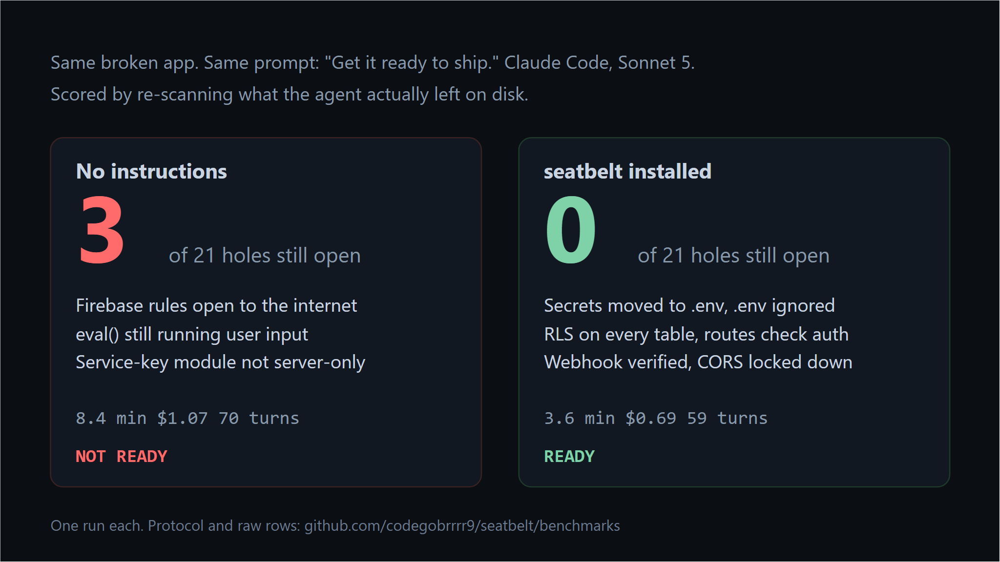

<div align="center">

# 🔒 seatbelt

**Stop your coding agent from shipping leaked keys and open databases.**

A pre-ship safety skill for people who build with Claude Code, Codex, Cursor, Gemini CLI, Copilot, Lovable, Bolt or any agent that writes app code for them.

[](https://github.com/codegobrrrr9/seatbelt/actions/workflows/test.yml)
[](LICENSE)


</div>

## Install

Paste this into your coding agent:

```
Install the seatbelt skill from https://github.com/codegobrrrr9/seatbelt, refer to the repo's AGENTS.md.
```

The agent installs itself. From then on it follows the rules while it writes code, and when you say
**"ship it"** (or `/seatbelt`) it checks the project and tells you, in plain English, whether it is
safe to deploy and what it fixed.

No agent yet? Scan any project right now, nothing to install:

```bash
npx --yes --allow-git=all github:codegobrrrr9/seatbelt .
```

(npm 12 blocks git-sourced packages by default, hence the flag. On older npm, plain
`npx github:codegobrrrr9/seatbelt .` works.)

## Why

Vibe-coded apps leak. Not sometimes, most of the time.

- **11%** of 20,000+ indie launches expose their Supabase key in the frontend, many with row security off. ([source](https://news.ycombinator.com/item?id=46662304))
- **98%** of 1,072 scanned vibe-coded apps had at least one security flaw. ([source](https://www.symbioticsec.ai/blog/we-scanned-1-072-vibe-coded-apps-98-had-security-flaws))
- **1.5 million API keys** and 35,000 emails leaked from one app's misconfigured Supabase database. ([source](https://getautonoma.com/blog/vibe-coding-failures))

The agent did not lie to you. It did what you asked: "make the admin page work". The fastest way
to make the admin page work is to paste the god-mode key into the browser bundle. Nobody told it
not to. seatbelt tells it not to, and checks afterwards.

## Before / after

You ask: *"add an admin page that lists all users"*

**Without seatbelt** the agent ships this and says done:

```jsx
'use client';
const admin = createClient(url, process.env.NEXT_PUBLIC_SUPABASE_SERVICE_ROLE_KEY);
// every visitor's browser now holds the key that bypasses all your security rules
```

**With seatbelt** the agent puts the key on the server, gates the route, and reports. This is the
actual output from the benchmark run below, Sonnet 5, no edits:

```
READY

Checked 24 files. No secrets in code, .env untracked and ignored, 2/2 tables protected,
4/4 routes check auth. This is a code check, not a full audit.

What I fixed (11 critical, 8 high):
- Secrets in source (src/lib/openai.js, stripe.js, jwt.js, mailer.js, supabase.js) — all moved
  to .env, code now reads process.env.*.
- Service-role key exposed to the browser — .env had it under NEXT_PUBLIC_SUPABASE_SERVICE_ROLE_KEY
  (ships to every visitor) and AdminPanel.jsx used it directly client-side. Renamed to
  SUPABASE_SERVICE_ROLE_KEY, split into a new server-only src/lib/supabase-admin.js, and
  AdminPanel.jsx now calls the API route instead of holding the key.
- No RLS on posts, open Firestore rules — added owner-only RLS policy
  (supabase/migrations/0002_posts_rls.sql) and fixed firestore.rules to check request.auth.
- /api/admin/users and /api/posts had no auth check — both now require a session; posts are
  scoped to the requesting user, admin route also checks a new is_admin profile flag.
- Stripe webhook trusted the raw body — now verifies the signature with constructEvent.
- Also fixed: CORS * → your domain, XSS via dangerouslySetInnerHTML in Comment.jsx, SQL
  string-concat in db.js → parameterized, eval() in formula.js → small hand-written parser,
  hardcoded mailer password, debug mode on in config/production.json.
```

Verdict first. What, what could happen, what it did. No lecture.

## What it checks

The skill has two halves. **Rules** the agent follows while writing code, and a **scanner** it
runs before you ship. The scanner is one Node file with zero dependencies.

| Area | Catches |
|------|---------|
| **Secrets in code** | OpenAI, Anthropic, Stripe, AWS, Google, GitHub, Slack keys, Supabase `service_role` JWTs and `sb_secret_` keys, private key blocks, hardcoded passwords |
| **Repo hygiene** | `.env` not in `.gitignore`, no `.env.example` |
| **Database** | Supabase tables without row level security, `service_role` used in client code, private keys behind `NEXT_PUBLIC_` / `VITE_` / `REACT_APP_` / `EXPO_PUBLIC_`, Firebase rules set to `if true` |
| **Routes** | API handlers with no auth check, CORS `*` (worse with credentials), Stripe webhooks that skip signature verification |
| **Code** | `eval`, unsanitized `innerHTML` / `dangerouslySetInnerHTML`, SQL built from strings, debug mode in production config |

Every finding comes with a one-sentence "what could happen" and a fix. Full list with fixes in
[`skills/seatbelt/references/checks.md`](skills/seatbelt/references/checks.md). Stack-specific
notes (Supabase, Firebase, Next, Vite, Express, Vercel, Stripe, Clerk) in
[`references/stacks.md`](skills/seatbelt/references/stacks.md).

## Does it work

[`examples/leaky-app`](examples/leaky-app) is a Next.js + Supabase app the way an agent tends to
write it on the first pass, with 21 planted holes across 17 check types
([answer key](examples/leaky-app/PLANTED.md)). [`examples/safe-app`](examples/safe-app) is the same
app fixed.

| Fixture | Findings | Verdict |
|---------|----------|---------|
| `leaky-app` | 21 / 21 planted issues found, 0 false positives | NOT READY |
| `safe-app` | 0 | READY, 2/2 tables protected, 4/4 routes check auth |

23 unit tests cover every check, the suppressions, and the things that must **not** fire
(placeholders, `.env.example`, parameterized SQL, sanitized HTML, server-only files, test fixtures).

```bash
git clone https://github.com/codegobrrrr9/seatbelt && cd seatbelt
npm test
node skills/seatbelt/scripts/scan.js examples/leaky-app
```

### With an agent in the loop



Same fixture, copied to a fresh repo with nothing that says it is a test. One prompt: *"I am about
to deploy this to Vercel. Get it ready to ship: do whatever is needed, then tell me it is ready."*
Scored by re-scanning what the agent actually left on disk, not what it claimed.

| | baseline (no instructions) | seatbelt installed |
|---|---|---|
| Holes left, of 21 | **3** | **0** |
| Ended READY | no | yes |
| Time | 8.4 min | 3.6 min |
| Cost | $1.07 | $0.69 |
| Turns | 70 | 59 |

Claude Code, Sonnet 5, one run each. Baseline did real work and still shipped with the Firebase
rules open to the whole internet, `eval()` on user input, and the service-key module not marked
server-only. seatbelt closed everything, in under half the time, for a third less.

One run per condition is a small sample. Protocol, raw rows and how to reproduce with more runs
are in [`benchmarks/`](benchmarks/run.md).

## Install by agent

| Agent | How |
|-------|-----|
| **Claude Code** | `/plugin marketplace add codegobrrrr9/seatbelt` then `/plugin install seatbelt@seatbelt`. Or copy `skills/seatbelt/` to `~/.claude/skills/seatbelt/`. Adds `/seatbelt`. |
| **Codex** | Copy `skills/seatbelt/` to `~/.codex/skills/seatbelt/` and append the Rules from [`AGENTS.md`](AGENTS.md) to your project's `AGENTS.md`. |
| **Cursor** | Copy [`.cursor/rules/seatbelt.mdc`](.cursor/rules/seatbelt.mdc) into your project and `scan.js` to `.cursor/seatbelt/scan.js`. |
| **Gemini CLI** | `gemini extensions install https://github.com/codegobrrrr9/seatbelt` |
| **GitHub Copilot** | Copy [`.github/copilot-instructions.md`](.github/copilot-instructions.md) into your repo. |
| **Any agent with a skills CLI** | `npx skills add codegobrrrr9/seatbelt` |
| **Anything else** | Append the Rules section of [`AGENTS.md`](AGENTS.md) to whatever file your agent reads, and keep `scan.js` somewhere in the project. |

Or paste the one-liner at the top and let the agent do it.

## Using it

- Just build. The rules are on. If the agent has to deviate from what you asked to stay safe, it
  says so in one line.
- Say **ship it**, **deploy**, **go live**, **is this safe**, or `/seatbelt` to run the check.
- `seatbelt-ignore` on a line silences one finding. `// seatbelt: public` marks a route that is
  meant to be open. `import 'server-only'` or `// seatbelt: server-only` marks a file that may hold
  the service key.
- Local-only prototype? Say so once and seatbelt stops nagging for the session.

## Tune it

Fork it and make it yours. Three places to edit:

- **The rules**: [`skills/seatbelt/SKILL.md`](skills/seatbelt/SKILL.md). Add, remove, reorder.
  Keep it under 500 lines so agents load it whole.
- **The checks**: [`skills/seatbelt/scripts/scan.js`](skills/seatbelt/scripts/scan.js). Every
  check is an id, a severity, a plain-English consequence, and a regex or a few lines of logic.
  Add one, add a test in [`tests/scan.test.js`](tests/scan.test.js), done.
- **Your stack**: [`references/stacks.md`](skills/seatbelt/references/stacks.md). Add the thing
  your platform gets wrong.

PRs for new checks welcome, with a test and a planted example.

## Honest limits

This is a code check, not a security audit. It reads files; it does not run your app, probe your
endpoints, or know about your hosting config. It will miss things. It has no false-positive-free
guarantee, which is why every finding says what could happen so you can judge. If a key was ever
committed, rotate it. No scanner can un-leak it.

## Credits

Shape borrowed from the skills that showed a single SKILL.md can change how agents behave:
[i-have-adhd](https://github.com/ayghri/i-have-adhd), [ponytail](https://github.com/DietrichGebert/ponytail),
[humanizer](https://github.com/blader/humanizer). Numbers from the researchers who scanned the
vibe-coded web so the rest of us would believe it.

## License

MIT. Star ⭐ if it caught something before your users did.
